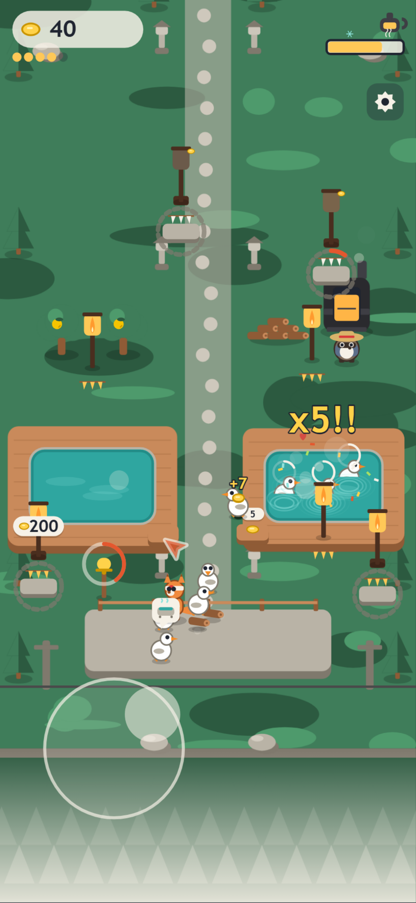
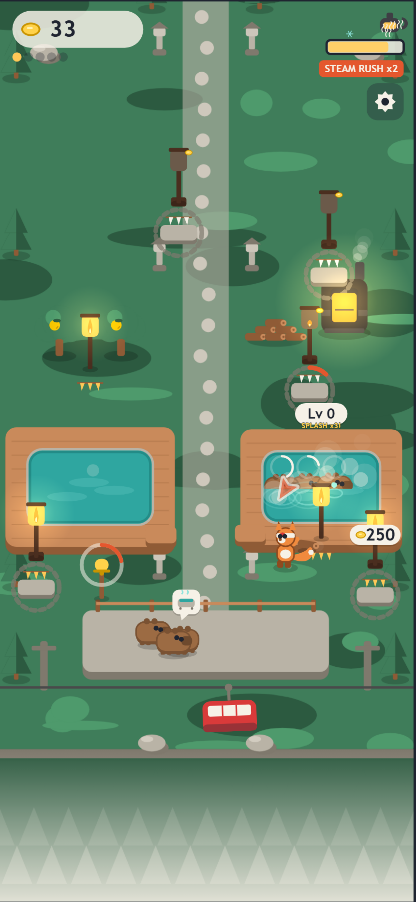
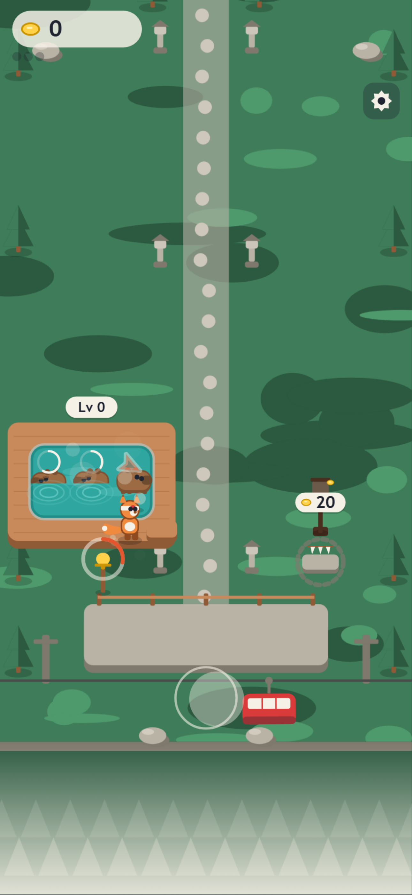
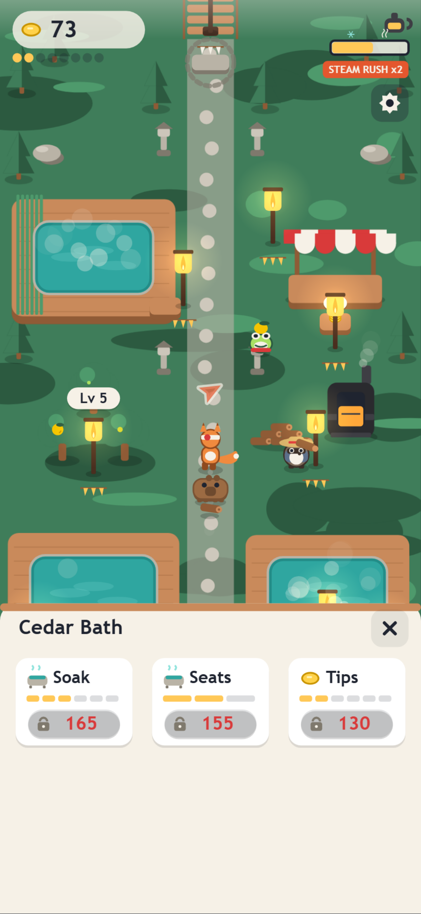
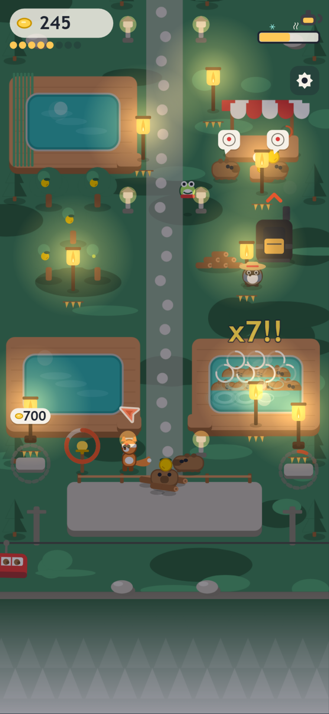
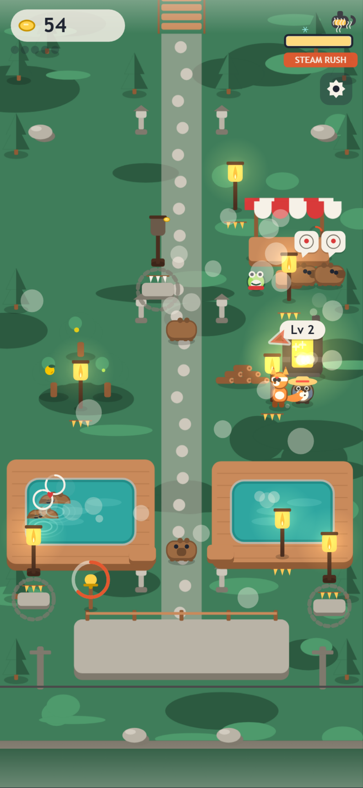
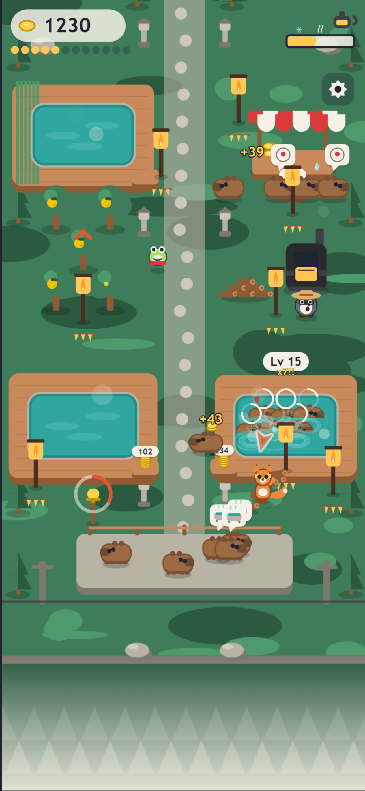
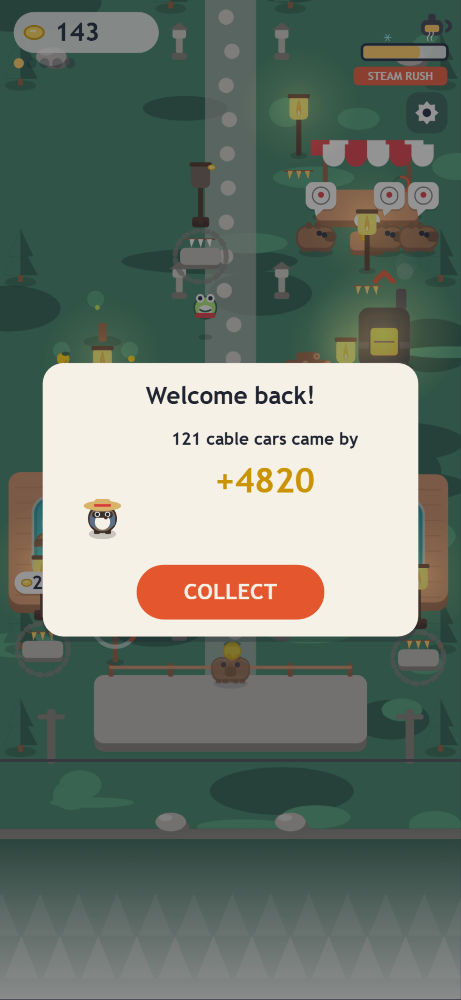
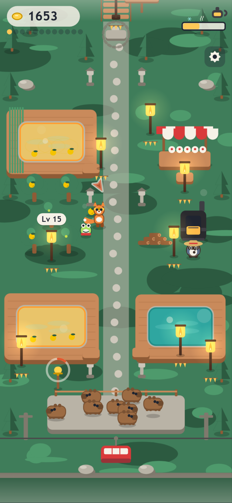

# Capy Springs

### Designing a one-thumb arcade-idle game — and proving the design worked before anyone played it

**Side project · 2026 · Product design, systems design, UX specification, art direction**

---

## At a glance

| | |
|---|---|
| **What** | Capy Springs — a cozy, offline, one-thumb mobile game. You are Kit, a fox innkeeper on a mountain hot spring: lead capybaras into steaming baths, feed a boiler for Steam Rushes, drop yuzu in the water for double pay, and light lantern posts with coins to grow the inn. |
| **My role** | Concept, core-loop and systems design, the full UX specification, art direction, sound direction, economy balance, and QA method. I wrote the two specification documents the build was made from and drove every design decision through implementation. |
| **Build** | Vanilla JavaScript + Canvas 2D, 39 modules, 5,676 lines, **zero dependencies and zero asset files** — every character, structure and sound is generated in code. Claude Code was my implementation partner; the design documents were the interface between us. |
| **Timeline** | Concept to first fully playable build: one focused sprint. |
| **Outcome** | Build 1.2.0 is complete and playable end-to-end: 30 minutes of content, 14 unlocks, 3 baths, 2 hireable helpers, a live event, offline earnings, and an automated simulator that plays and verifies the whole thing in about three seconds. |

**Headline numbers**

- **2,018 lines of specification** written before the first line of code
- **12-rule wayfinding system**, 7 one-word prompts, **0 tutorial screens**
- **108,000 simulated frames** (30 minutes of play) verified in ~3 seconds, on every change
- **2 design bugs** caught by the simulator that ordinary playtesting would have blamed on "feel"
- **776 guests served, 0 lost** in a 30-minute automated run
- **26 sound effects**, all synthesised at runtime; no audio files ship

---

## 1. Why I built this

I am a product designer. Most of my portfolio is interfaces where the user already knows what they want — they came to book something, buy something, file something. I wanted a project where **the interface has to create the motivation**, not just serve it.

Casual mobile games are the hardest possible version of that problem:

- The player gives you **six seconds** before deciding whether to keep going.
- They play **one-handed, on a bus**, with the sound off.
- There is no onboarding budget. Nobody reads a tutorial.
- And every competitor in the genre has spent millions optimising the same dopamine loop.

I also wanted to test a second thing: whether I could take a project all the way to a working artefact by designing it *precisely enough to be built*, rather than handing over a Figma file and hoping. This case study is as much about that method as about the game.

---

## 2. Constraints I set before designing anything

I wrote these down first and never moved them. They did more design work than any moodboard.

| Constraint | Why |
|---|---|
| **One thumb, no buttons** | The entire play loop is walking. Every station reacts to proximity. Taps exist only for UI, never for the loop. If the game needs a button, the design is wrong. |
| **No failure state, ever** | Cozy and stressful cannot coexist. Nothing is ever taken away from the player. A guest who runs out of patience simply walks off — no red, no penalty screen. |
| **Fully offline** | No account, no server, no ads, no timers that tick while you are not there begging you to come back. It runs from a file. |
| **Readable on a 6-inch phone at arm's length** | Minimum 4 px drawn features, minimum 56 px tap targets, one call-to-action colour, and **no state communicated by colour alone**. |
| **60 fps on a mid-range Android** | Performance is a design constraint, not an engineering afterthought. A frame budget of 12 ms shaped the art direction more than any style reference. |
| **Distinct from the genre template** | Not "another stacking game". If a mechanic is standard in the genre, replace it with one that carries the theme. |

That last one drove the two mechanics the whole game is built on.

---

## 3. Concept: four pitches, one winner

I wrote four complete one-page concepts and judged them against a single question: **what is the thing you do with your thumb, and is it interesting on its own?**

Capy Springs won because its answer was not "collect and deposit" — it was "**lead**". And leading turns out to be visually and mechanically richer than carrying:

| Genre convention | What I did instead | What it buys |
|---|---|---|
| Stack items on your head | **The Trail**: guests, logs and fruit all join one wobbly line behind you, sharing one capacity number | The customers *are* the cargo. The line visibly grows as you upgrade, so progress is legible without a single number on screen |
| Per-machine timers | **Heat**: one shared boiler gauge every heated bath depends on | One resource creates a decision instead of a chore list |
| Glowing pads you stand on to pay | **Offering steps**: stone steps at a shrine lantern, coins tossed into a box one by one, flame grows, the building unwraps from paper | The payment moment becomes the reward moment, and it fits the world |
| Cash on the floor | **Coin trays** on each deck, positioned on the path you already walk | Collecting is never a detour — it is a consequence of moving well |
| Pop-ups announcing unlocks | Structures **unwrap** from paper wrapping in place | The world grows in front of you; nothing rises out of the ground |


*The core loop, one frame: a trail of guests behind Kit, a five-guest Splash Chain landing across the deck, a coin tray filling, a lantern showing what the next 200 coins buys — and the floating joystick under the thumb.*

---

## 4. The core loop, designed as a rhythm

The loop is `LEAD → SOAK → COLLECT → LIGHT`, with `STOKE` and `YUZU` as optional detours that multiply income. But the loop is not the design — **the tempo is**.

A cable car docks every 18 seconds at the start, stretching to 25 seconds as the cars grow. That bell is the game's heartbeat, and everything is tuned around it:

- Soaks last 8 seconds, dropping to 5. Slots free in the order guests entered, so someone is always climbing in or out.
- The **Splash Chain** window is 2 seconds and is global across all baths. Three guests landing in that window is a chain; splitting a full trail across two decks to make five is the skill nobody is taught and everybody discovers.
- **Nothing on screen waits more than a second to react.** Guests join the trail 0.12 s apart. Coins reach the counter in 0.35 s. The upgrade sheet slides in over 0.2 s.
- The decision the player actually makes, every 20 seconds, is: **which detour fits before the next car?**

That question is the whole game. Everything else — the art, the sound, the numbers — exists to make that question feel good to answer.


*A chain landing. The combo number, the screen bump, the ripple rings and a 40 ms freeze all fire on the same frame — four channels saying one thing.*

---

## 5. Onboarding: the first 30 seconds are a script, not a tutorial

I refused to ship a tutorial. Instead I wrote the first 30 seconds as a **second-by-second script** — what is on screen, what the player does, what they hear — and then built the systems to satisfy it.

| Time | What happens |
|---|---|
| 0.0 s | Cream fades to the deck. The first cable car is **already docked**. Nothing has to be waited for. |
| 0.6 s | Three capybaras hop out with speech bubbles showing one icon: a bath. The arrow above Kit points at the nearest one and says **LEAD**. |
| 2.0 s | First touch. The bell rings (that gesture is also what unlocks audio, so the player's first input is confirmed by the world, not by a sound effect). The joystick blooms under the thumb. Guests fall in behind Kit. |
| 6.0 s | First **SPLASH x3** — gold number, screen bump, arpeggio, a single 40 ms freeze. Under six seconds to the first reward. |
| 11.0 s | Guests climb out and flick coins into a tray that sits **on the path back to the platform**. The arrow says **COLLECT**. The player learns collection by walking where they were already going. |
| 19.0 s | They stand on an offering step. Coins toss into the box with rising pitch, the flame flares, the paper wrapping tears off the Cedar Bath. First unlock, 19 seconds in. |
| 31.0 s | The loop is running. No text has appeared except four single words. |

Three deliberate concessions live in here and nowhere else: the first car's guests have **infinite patience**, their soak is shortened to 5 seconds, and if the player has not touched the screen by 3.1 seconds a **ghost thumb** appears and loops a drag gesture until they do. That is the entire tutorial system.


*Twenty seconds in: three guests soaking, a coin tray about to fill, and the next 20-coin unlock showing its price in the world rather than in a menu.*

---

## 6. Wayfinding: one arrow, twelve rules

The hardest UX problem in an idle game is not teaching the mechanics. It is answering, **at every single moment, "what now?"** — without a quest log, a checklist, or a wall of badges.

My answer is one arrow above the player's head, driven by a strict priority list evaluated every frame, first match wins:

```
1  SOAK (chain live)  →  the nearest warm bath with a free seat
2  SOAK               →  the bath that seats the most of your trail
3  STOKE (urgent)     →  the boiler, but only if heat is under 40
4  YUZU               →  the nearest bath that is not already golden
5  STOKE              →  the woodpile
6  LIGHT              →  the cheapest lantern you can now afford
7  LEAD               →  the nearest waiting guest
8  COLLECT            →  the fullest coin tray within 400 px
9  YUZU (stall)       →  a ripe tree, if a guest is waiting on food
10 TAP                →  the station holding the cheapest affordable upgrade
11 YUZU               →  a ripe tree
12 dim                →  the cheapest thing you are saving toward
```

Three design rules make this work as an interface rather than a nag:

- **It is subtle while you move and grows only when you stop.** Alpha 0.7 in motion, full size and bouncing after 2 seconds of idle. It advises; it does not interrupt.
- **It never points at nothing.** Rule 12 is a dim arrow at whatever you are saving for. The arrow only disappears when every lantern and every upgrade is maxed — which is also how the game signals "you have seen everything".
- **Words appear twice and then never again.** Seven one-word prompts — LEAD, SOAK, COLLECT, LIGHT, STOKE, YUZU, TAP — each shown the first two times its rule fires. Never more than one word on screen. After about two minutes the game is silent and the player is fluent.

This list is also the reason the game could be tested automatically, which turned out to matter more than I expected. More on that in section 9.

---

## 7. The interface system

Everything is drawn on one canvas. There is no DOM, no component library, no framework — so every control had to be specified as precisely as a design system token.

**Layout.** A fixed logical space of 540 × H, where H stretches from 960 to 1200 so taller phones show more mountain rather than letterboxing. One logical pixel is about 0.7 CSS pixels on a 6-inch phone, which is why the minimums (4 px features, 56 px tap targets) are stated in logical units and treated as hard floors.

**The thumb zone is sacred.** The camera is clamped so the arrival platform — where the action is — never sits below 65% of the screen height. The bottom third belongs to the hand.

**The joystick is floating and trailing.** It appears wherever the thumb lands in the lower 70% of the screen, has an 8 px dead zone, and reaches full speed at 70% of its radius so short travel is enough. Once the thumb gets more than 90 px from the base, **the base follows the thumb** — so reversing direction never requires dragging all the way back. This is the single change that made the game feel good on a phone rather than on a desktop with a mouse.

**HUD.** Four elements, and each one earns its place:

| Element | Behaviour |
|---|---|
| Coin pill | Scales 1.25 → 1 and rolls the number up each time a coin flight lands, so income has a physical arrival |
| Trail pips | One dot per capacity slot; all full → the row pulses. The only capacity readout, because the trail itself is on screen |
| Heat gauge | Hidden until the boiler exists. Under 30, a frost hatch fills the empty part; over 80, steam wisps grow from the bar — **state is shape plus colour, never colour alone** |
| Gear | 60 × 60 hit target, opens a five-row popover |

There is deliberately **no timer for the cable car in the HUD**. It lives in the world, as a countdown ring on the bell post, readable from anywhere on the map. Information that belongs to the world stays in the world.


*The station sheet. Three choices maximum — Soak, Seats, Tips — level pips instead of numbers, and unaffordable states carrying a lock glyph as well as a colour change. Tapping buys instantly; there is no confirmation step, because nothing here can hurt you.*

---

## 8. Art and sound direction, written as rules

I could not draw assets — there are none. Every shape is generated at runtime from the same set of primitives. That forced the art direction to be written as **rules a machine could follow**, which is the most rigorous style guide I have ever had to produce.

**"Chunky paper cutout":**

- Every object is 2–3 flat fills: a top colour, an 8–12 px darker "thickness" band along the bottom edge, and a soft ellipse shadow. That is the entire illusion of depth — no camera projection, no isometric maths.
- No outlines anywhere except a 2 px darker stroke on characters, so they stay readable at 40 px.
- **The silhouette test**: every character rendered as a flat ink shape at 50% scale must still be identifiable. Kit is ears and a tail. A capybara is a loaf with a snout. A duck is a ball with a beak. Pon is a wide hat. There is a page in the project that renders exactly this row, and it is the gate any new character has to pass.
- Personality lives in **motion, not faces**: squash-and-stretch on every landing, a tail that lags opposite to velocity, soaking guests who sink 4 px and puff a heart every 3 seconds, eyelids that drop in three steps as a soak completes.

**Colour has grammar, not just tokens.** The 24-token palette is governed by three rules I never broke:

1. **Yellow means money, yuzu and glow — nothing else.** No character wears it.
2. **Vermilion `#E4572E` is used for calls to action and nothing else** — the arrow, affordable outlines, the upgrade chevron, the COLLECT button. Any text in it carries a 3 px cream stroke so it survives on any background.
3. Kit is the only saturated red-orange on screen, so the player's eye finds themselves instantly in a busy frame.

**Sound is UI.** All 26 effects are synthesised — no files. More importantly, several of them carry information the screen does not:

- Guests joining the trail play a blip **rising in pitch with position in the line**, so you hear your trail fill without looking at the pips.
- Coins reaching the counter climb a semitone per coin in a burst, so a big payout *sounds* big.
- Standing on an offering step ticks upward in pitch as it drains, so you know how close you are without reading the arc.
- Nothing plays before the player's first touch — and that first touch triggers the cable car's bell, so the audio unlock is disguised as a world event.


*Lantern Night: every three minutes, 60 seconds of indigo sky, glowing lanterns, cars every 12 seconds and +20% pay. Implemented as one multiply tint plus a pass of pre-rendered halo sprites — a whole mood for almost no frame budget.*

---

## 9. The part I am most proud of: I simulated the game instead of guessing

Here is the problem with designing a game like this: **the mechanics interact**. Heat drains faster while baths are occupied. Occupancy depends on how big your trail is. Trail size depends on what you unlocked. What you unlocked depends on income. Income depends on chains. Chains depend on whether the arrow sent you to the right bath.

You cannot hold that in your head, and you cannot find its failure modes by playing for ten minutes.

So I specified a **headless simulator** as a first-class deliverable, alongside the game design document. It runs the real game — every system, every number — with no screen, driven by a bot that plays using **the exact same priority list that draws the on-screen arrow**. Thirty minutes of play, 108,000 frames, in about three seconds.

It checks three things on every run:

- **Invariants**, once per simulated second: no guest is in two seats at once, no item is stuck in the trail, the camera never inverts on a tall phone, the save round-trips byte-for-byte, and the presentation layer never touches the seeded random number generator (so a run produces identical numbers with or without rendering).
- **Progression checkpoints**: the Cedar Bath and two chains by 30 seconds, Pon hired by 10 minutes, the Bamboo Tub by 20 minutes, under 15% of guests lost at 30 minutes.
- **The economy curve**, recorded minute by minute to a CSV.

There is also a fuzz mode that plays with random input for five minutes, taps random coordinates, buys random upgrades, and simulates the phone being locked and unlocked with the clock shifted by random hours.

**Why this is a design tool, not a QA tool:** the bot plays with my arrow logic. So when the bot behaves badly, **my guidance design is what is broken** — and I can see it in seconds rather than after twenty minutes of confused play.

---

## 10. Two design bugs the simulator found

These are the two findings that justified the entire method.

### The lanterns nobody was ever pointed at

In my original priority list, `LIGHT` (spend coins on the next unlock) sat *below* `LEAD` (pick up a waiting guest) and `COLLECT` (grab coins). It read as obviously correct on paper: guests are time-sensitive, money is not.

In simulation it was catastrophic. Once cars started arriving every 21 seconds with five guests each, **there was always someone waiting** — so `LEAD` matched forever and the arrow never once pointed at an unlock after the first one. A player following the arrow faithfully would grind indefinitely and never see the game open up.

The fix was to move `LIGHT` above both, justified by a number I only had because I had measured it: lighting a lantern takes 1–2.5 seconds, and platform patience is 40 seconds. The detour is free. **It only looked like a priority problem; it was actually a timing problem.**

### The infinite firewood shuttle

Rule 3 said: if you are carrying logs and the boiler is not full, go to the boiler. Also obviously correct.

The simulator produced a player that walked between the woodpile and the boiler **forever**: passing the woodpile auto-picked up logs, carrying logs triggered rule 3, dropping them let it pass the woodpile again. The run ended with **158 chained Steam Rushes and 78% of guests lost** — the most profitable per-guest state in the game, reached by abandoning all the guests.

The fix was to make the rule conditional on actual need: logs are urgent only when heat is below 40 or the water has gone cold. Otherwise they ride along in the trail and get dropped off after the next collection.

I want to be honest about what would have happened without the simulator. I would have played, felt that something was "off", assumed the movement speed or the drain rate needed tuning, and spent a day adjusting numbers — because the failure presents itself as bad *feel*, not as a broken rule. **The simulator turned a feel problem into a logic problem I could read in a diff.**


*A Steam Rush chain. Getting this to be exciting rather than mandatory took the grace period, the drain rates and the rule-3 gate all working together — three knobs found by simulation, not by feel.*

---

## 11. Balancing with data instead of intuition

I originally derived the income curve by hand from the constants. When I ran the simulator against it, the shape was right and the magnitude was wrong — because my hand table had not accounted for how much the player *spends* on upgrades along the way.

I replaced my table with the measured one. This is what a 30-minute run looks like:

| Play time | 2 min | 5 min | 10 min | 20 min | 30 min |
|---|---|---|---|---|---|
| Coins earned | 287 | 1,678 | 4,963 | 15,206 | 32,078 |
| Guests served | 24 | 88 | 202 | 464 | 776 |
| Guests lost | 0 | 0 | 0 | 0 | 0 |
| Five-guest chains | 1 | 9 | 22 | 50 | 80 |
| Steam Rushes | 0 | 5 | 14 | 28 | 35 |

The decision that came out of this was a restraint decision: **I changed nothing about the payouts.** The unlock pacing the curve produced — Cedar Bath at 12 seconds, a helper hired at 2:35, the third bath at 5:06, the finale at ~25 minutes — matched what I had designed on paper. The number that was "wrong" was my arithmetic, not the game.

To keep that honest going forward, the simulator prints a **balance warning** if income ever overshoots the measured curve by 40%, and names the four tuning knobs to turn, in order. The design document records the order. A future me, or anyone else, cannot quietly inflate the economy without the tool saying so.


*Twenty-five minutes in: three baths, two hired helpers, a snack stall, coin trays holding 102 and 34, a guest queue with food orders, and a five-guest chain landing. Every one of these systems was tuned against the measured curve above.*

---

## 12. Respecting the player when they are not playing

Two decisions here mattered more than their size suggests.

**Offline earnings are capped on purpose.** Away time counts for at most 2 hours, at a quarter rate, based on a median of your recent income rather than your best minute. The point of the welcome-back card is a warm greeting and a reason to open the app — not a mechanism that makes playing feel pointless. Coins earned while away never feed the rate calculation, so the number cannot spiral.

**And it cannot be lost.** During review I found that if the phone locked while the "Welcome back" card was still open, the earnings were silently recomputed over and thrown away. The fix: the save timestamp is held until the player actually taps COLLECT, and a resumed tab keeps the card rather than recalculating on top of it. A player who puts the phone down mid-greeting loses nothing.


*The welcome-back card. One number, one button, and a character waving — deliberately modest, because generosity here would undercut the reason to play.*

---

## 13. Accessibility and comfort

Not an afterthought section — these were written into the specification alongside the mechanics:

- **No state is communicated by colour alone.** Cold water gets a frost hatch pattern and a white dash on the rim. Hot water grows steam wisps. Affordable offering steps have a solid outline, unaffordable ones a dashed one. The upgrade sheet uses lock and check glyphs in addition to colour.
- **"Shake & flash" can be turned off**, which zeroes camera shake, the frame freezes and the white flash in one switch — for motion sensitivity, and for anyone who just finds screen shake unpleasant.
- **Shake is bounded anyway**: never more than 8 px, always decaying within 0.3 s; the white flash never exceeds 0.35 alpha. Frame freezes are capped at 150 ms total per second and never freeze the joystick, so the game never stops responding to your thumb even while the world holds still.
- **Text is rationed.** At most three words on screen at any time, with an explicit priority order when several elements want the space. Speech bubbles carry one large icon and no text at all, so the game needs no translation.
- **Low-effects mode** turns itself on if frame time degrades, and — importantly — **never turns itself back off automatically**. It appears as a row in settings so the player, not the game, decides.

---

## 14. Performance as an art direction brief

A 12 ms frame budget and a 2 ms simulation budget shaped the visual language directly:

- **No blurs, no filters, no gradients created per frame.** Every glow in the game is one pre-rendered sprite blitted with varying alpha, capped at 8 per frame. That constraint is why the night scenes look like paper lanterns rather than bloom.
- **The entire static world is one cached image**, rebuilt only when a building finishes unwrapping.
- **Depth is one sort** of at most 150 objects by their feet position — which is exactly why the projection is a flat top-down-oblique with painted thickness bands instead of a real 3D camera.
- Stroked text costs two rasterisations, so it is rationed to the elements that must survive any background: combo pops, the arrow word, the banner. Everything else sits on a pill.

The debug overlay turns red the moment any of these budgets is exceeded, so the constraint is visible while playing rather than discovered in a report.

---

## 15. What shipped

Scope was tiered from day one — **Core**, **Plus**, **Stretch** — and the tiers held. Build 1.2.0 contains all of Core and all of Plus:

Three baths with independent upgrade tracks · the Trail with four capacity tiers · the global Splash Chain · Heat with chaining Steam Rushes · the yuzu grove and golden baths · a snack stall with a food-order chain · two hireable helpers · cable cars with four size tiers, duck flocks and Golden Cars · 14 lantern unlocks · Lantern Night · the Ridge Bridge finale and Season Fame levels · save with offline earnings · a settings popover · and the full simulation harness.

Deliberately left for later: a crow micro-event, a dash move, and a second zone up the mountain. All specified, none built — because the finale already lands at 25 minutes and adding to the middle would have thinned it.


*Thirty minutes in — the whole inn: three baths (two running golden yuzu water), the boiler and woodpile, the yuzu grove, the snack stall, both helpers working, and a platform full of guests.*

---

## 16. What I learned

**Specify the feel, not just the layout.** The spec that made this buildable did not stop at screens. It states that guests join 0.12 s apart, that the screen bumps 4 px on a three-chain and 8 px on a five, that the arrow sits 46 px above the player's head and bobs 4 px at 3 Hz. Those numbers are the design. Leaving them to "implementation detail" is leaving the product to chance.

**Testability is a design property.** The single decision that paid off most was making the guidance system a pure function of game state — a list of rules with no hidden state. That was originally a clarity decision. It is what made the game automatically playable, which is what found the two bugs in section 10. **Designs that can be explained as rules can be verified as rules.**

**Constraints are faster than references.** "No asset files" sounds like a limitation and behaved like a brief. It produced the silhouette test, the thickness-band depth language, and a palette with actual grammar — all of which I would not have arrived at by collecting screenshots of games I liked.

**Measure before you tune.** My hand-built economy was wrong in magnitude and right in shape. If I had adjusted payouts to match my own arithmetic, I would have broken pacing that was already correct. The instinct to fix is much stronger than the instinct to measure, and it is usually wrong.

---

## 17. Where it goes next

The nearest thing to an honest limitation: build 1.2.0 has been verified in a mobile-sized browser and by the simulator, but **not yet in a 20-minute session on a real phone in someone's hand**. That session is the next step, with the performance overlay on, because feel on glass is the one thing neither the spec nor the simulator can tell me.

After that: the crow micro-event, then the dash, then the Ridge — in that order, because each one adds a new verb rather than more of an existing one.

---

*Capy Springs runs from a single HTML file with no network, no accounts and no analytics. Nothing about the player leaves their device.*
